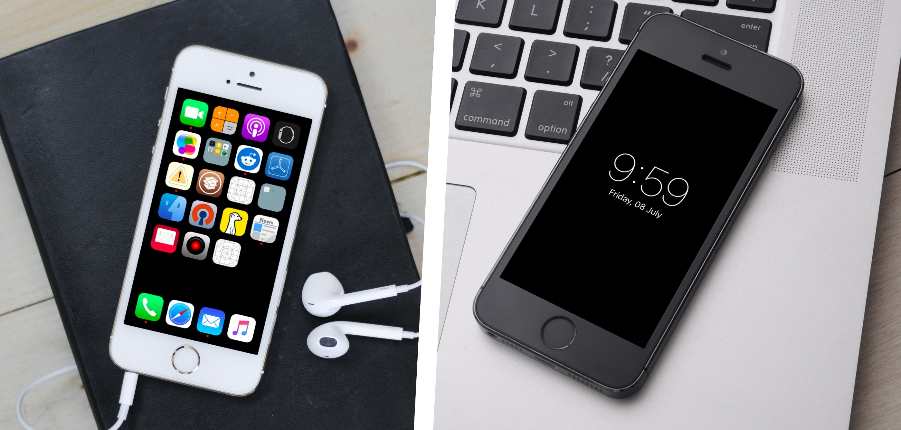

# Zen

## What it is
A "theme tweak" for a minimal look of iOS

## Requirements

This tweak is optimal
 - iOS 9.0.2 jailbroken
 - iPhone 5, 5s or SE (spacing on icons are optimised for this)
 
Also confirmed to work on 7.0.2/5C and 8.4/5S.
 

## How it looks like
Looks something like this, but better on the actual device.  

## How to get it 

Search the paclage in cydia (it's in the modmyi default repo).

## Changes I (ArtikusHG) made

- Add iOS 10 support.

## Know bugs (iOS 10)

- Wallpaper shows for a second or so when you open the app switcher.

- Wallpaper shows for a second or so when you swipe to camera on lockscreen.

## Bug fix / self-solve (for both bugs)

Download a black image and set it as wallpaper. Also for the app switcher I have a fix in the source code, but this is a very dirty hack which is disabled in the modmyi package. It cuses memory overload, and makes the device respring randomly. So if you are a developer, you'll understad how to enable it if you need it. If you're a user, just use a black wallpaper.
